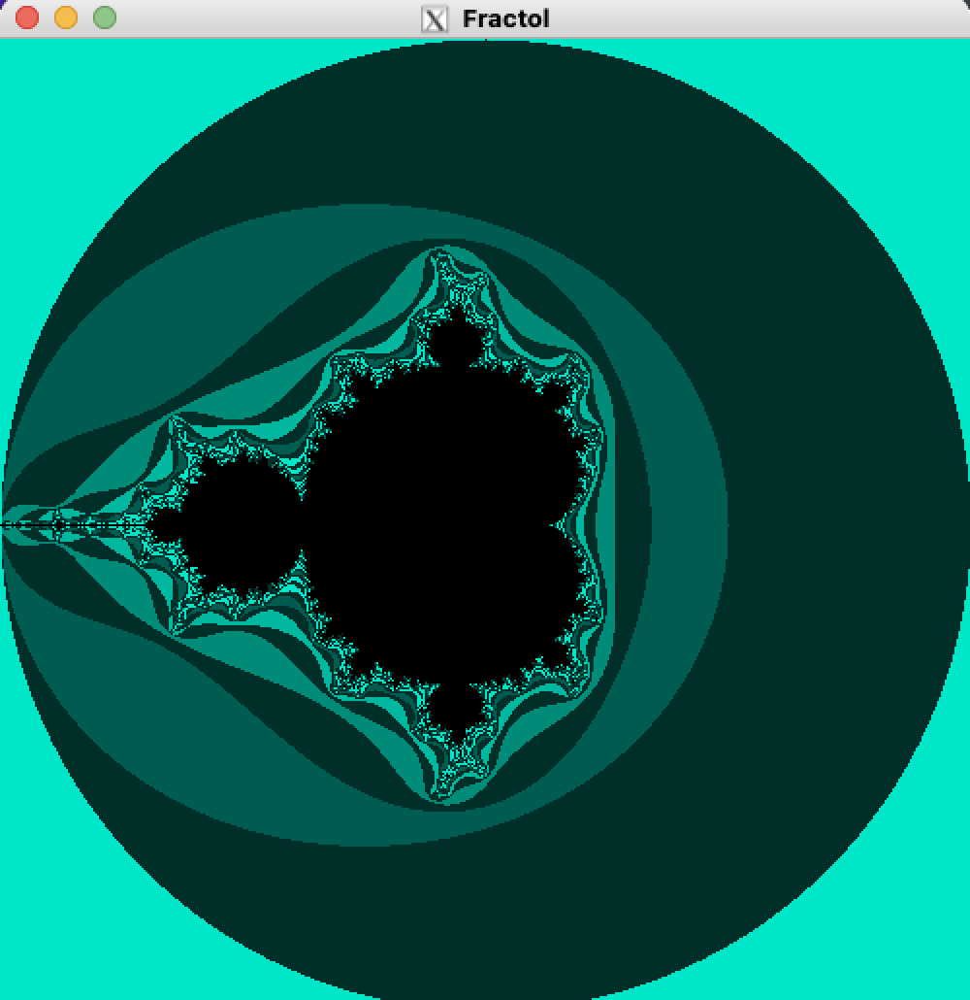
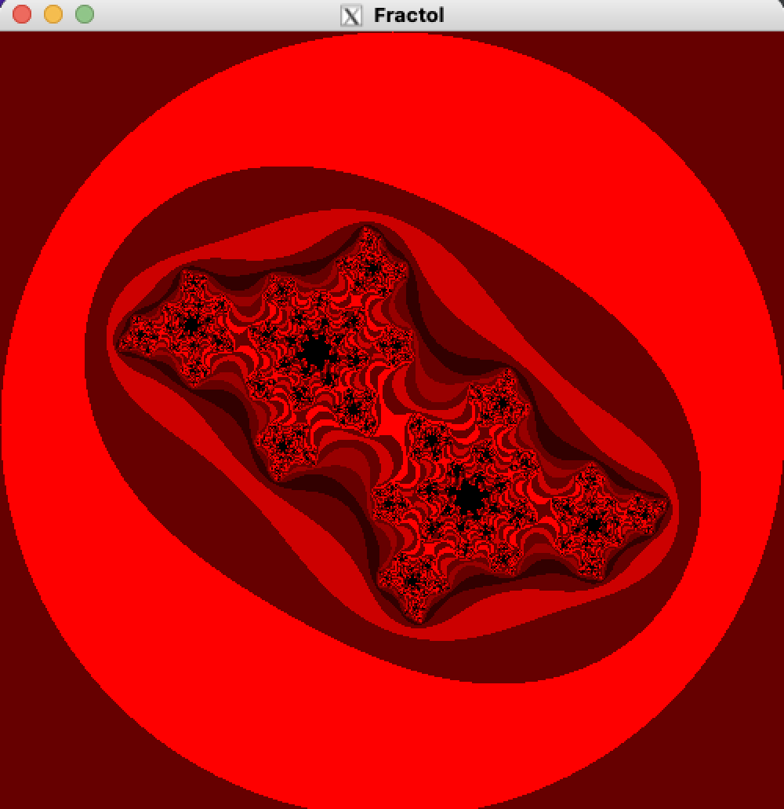
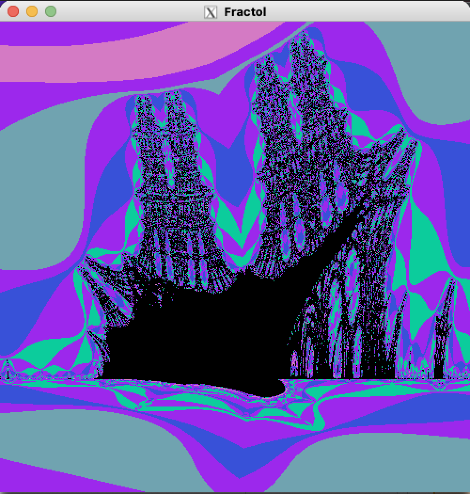
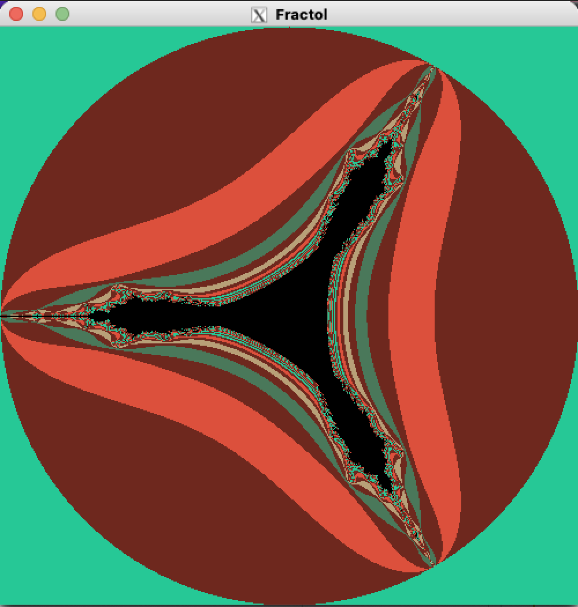

# fract-ol

## Description

This is a fractal render program written in the C language.

## Features

There is 4 fractals implemented :

- mandelbrot
- julia
- burningship
- tricorn

## Requirement

- macOS
- gcc or Clang
- GNU Make

## Usage

```
git clone https://github.com/ryo-manba/fract-ol
cd fract-ol && make
```
An executable named fractol will be created.
```
./fractol [FRACTAL_NAME]
```

## Samples

### Mandelbrot


### Julia


### Burning Ship


### Tricorn


## Author

[twitter](https://twitter.com/ryo_manba)

## Licence

All code is released under the [MIT](https://github.com/ryo-manba/fract-ol/blob/main/LICENSE) license
